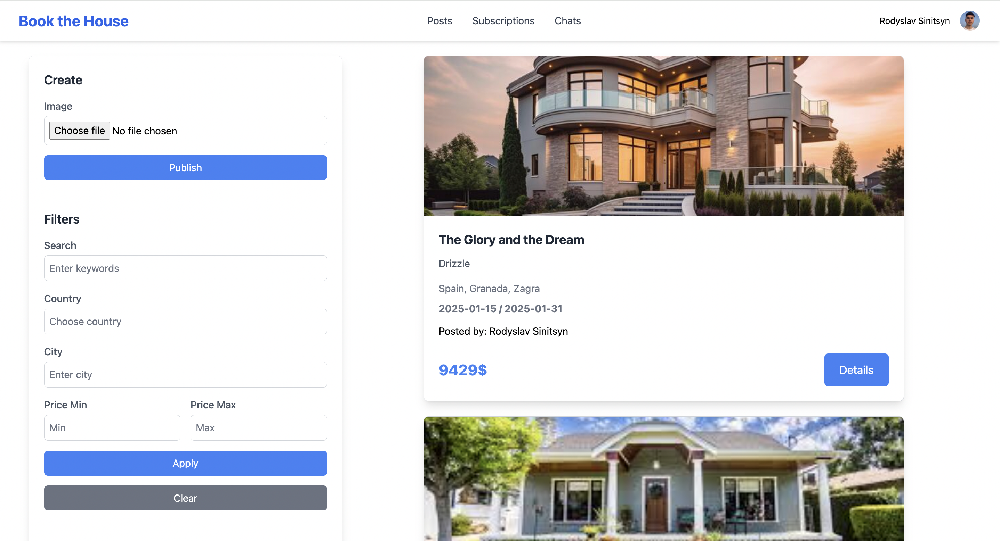

# Book the House

**Book the House** is a web application for managing house bookings, subscriptions, and chats with users. App is built for educational purpose, it's a clone of _booking.com / airbnb_

---

## Tech Stack

- **Backend**: Spring MVC, Spring WebFlux, Spring GraphQL, Spring WebSocket, Hibernate
- **Frontend**: Vanilla JS, Thymeleaf, Tailwind CSS
- **Storage**: PostgresQL, PostGis, Elasticsearch, Minio
- **Cache**: Redis
- **Authentication**: OAuth2 (Google, GitHub), Spring Security
- **Messaging**: RabbitMQ, Firebase Cloud Messaging
- **Logging**: Elasticsearch, Logstash, Kibana
- **Monitoring**: Actuator
- **Documentation**: Swagger
- **Test**: JUnit5, Mockito, Gatling, Spring Test
- **Build Tool**: Maven, Docker, Git CI
- **Libraries**:
  - Lombok
  - Guava / Apache
  - Logback
  - ModelMapper
  - Resilience4j
  - Liquibase
  - FreeMarker
  - Spring JPA Specification
  - Spring AOP
  - Spring Email

---

## Features

- **User Authentication**: Login and signup with Google and GitHub.
- **House Listings**: Browse, publish, filter posts. Find nearest to your location
- **Subscriptions**: Subscribe to users updates and get email notifications of new posts.
- **Chat System**: Real-time messaging between users.
- **Dynamic UI**: Responsive and interactive UI built with Tailwind CSS.
- **Notifications**: Popup notifications of incoming events.

---

## Microservices

### 1. **bth-ui**
_Description_:  
Entrypoint to the application. Basically the UI microservice. Uses Spring MVC and Thymeleaf to render web pages

---

### 2. **bth-post-service**
_Description_:  
Main GraphQL microservice. Integrated with Postgres. Manages the posts and subscriptions. Sends messages to the RabbitMQ.

---

### 3. **bth-image-service**
_Description_:  
REST microservice. Integrated with Minio via S3 API. Responsible for features like: upload, download, delete blobs.

---

### 4. **bth-notificator**
_Description_:  
Listens to the queue and sends Email notifications.

---

### 5. **bth-common (library)**
_Description_:  
Has common classes, configurations, properties for other microservices.